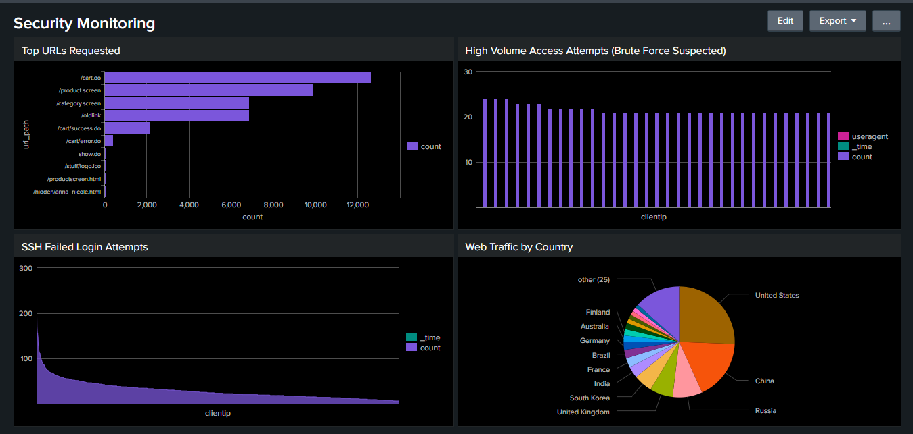

# Splunk Security Monitoring Project

### Index 

| Section                         | Description                                         |
|--------------------------------|-----------------------------------------------------|
| Introduction                | Overview of the project and dataset                  |
|  Step 1: Creating an Index   | Setting up a dedicated storage location for events   |
|  Step 2: Uploading the Dataset | Ingesting the `tutorialdata.zip` into Splunk         |
|  Step 3: Checking the Source Types | Identifying different data sources in the dataset    |
| Step 4: Creating Dashboard Panels | Building visualizations for security monitoring       |
| &nbsp;&nbsp;&nbsp;5.1 Panel 1 | Top Requested URLs (Potentially Suspicious)          |
| &nbsp;&nbsp;&nbsp;5.2 Panel 2 | High Volume Access Attempts (Brute Force Suspected)  |
| &nbsp;&nbsp;&nbsp;5.3 Panel 3 | SSH Failed Login Attempts                             |
| &nbsp;&nbsp;&nbsp;5.4 Panel 4 | Web Traffic by Country                                |
| Step 5: Final Dashboard     | Consolidating all panels into a single monitoring view |

## **Introduction**

This project demonstrates how to build a fully functional **Security Monitoring Dashboard** in Splunk, covering data ingestion, index creation, SPL (Search Processing Language) queries, dashboard panels, and alerts.

We will use the sample dataset **`tutorialdata.zip`** provided by Splunk, available here:

[Download the tutorial dataset](https://docs.splunk.com/Documentation/Splunk/9.4.2/SearchTutorial/Systemrequirements#Download_the_tutorial_data_files)

By the end, you will have a dashboard similar to the one shown below:

 <br><br>


## Step 1: Creating an Index

In Splunk, an **index** is a storage location for incoming events. Creating a dedicated index for this project helps keep the dataset organized and separate from other data.

1. Navigate to **Settings > Indexes**.
2. Click **New Index**.
3. Name the index, for example:
    
    `bots_index`
    
4. Save the configuration.

<br><br>

## Step 2: Uploading the Dataset

1. Go to **Settings > Add Data**.
2. Select **Upload**.
3. Upload the `tutorialdata.zip` dataset and assign it to the `bots_index` created earlier.
4. Once uploaded, verify that events are being indexed by running:

```
index=bots_index

```

You should see the ingested events in the search results.

<br><br>

## Step 3: Checking the Source Types

To understand the types of logs in the dataset, run:

```
index=bots_index
| stats count by sourcetype

```

This will display all the `sourcetype` values in the index. In our dataset, there are three main source types. Each will be analyzed separately.

<br><br>

## Step 4: Creating Dashboard Panels

We will create several panels to detect potentially malicious activity. Panels will be added to a single security monitoring dashboard.<br><br>


### Panel 1: Top Requested URLs (Potentially Suspicious)

**Purpose:** Identify the most accessed URLs, which could reveal potential attack targets.

**SPL Query:**

```
index=bots_index sourcetype=access_combined_wcookie
| stats count by uri_path
| sort - count
| head 10

```

**Explanation:**

- `stats count by uri_path` counts the number of requests for each URI.
- `sort - count` sorts results in descending order of request count.
- `head 10` limits results to the top 10 URLs.

<br><br>

### Panel 2: High Volume Access Attempts (Brute Force Suspected)

**Purpose:** Detect possible brute force attempts by finding multiple failed login events from the same IP within a short time window.

**SPL Query:**

```
index=bots_index sourcetype=access_combined_wcookie
| bucket _time span=5m
| stats count by clientip, useragent, _time
| where count > 20
| sort - count

```

**Explanation:**

- `bucket _time span=5m` groups events into 5-minute intervals.
- `stats count by clientip, useragent, _time` counts events per IP and user agent in each time bucket.
- `where count > 20` flags IPs with more than 20 requests in 5 minutes.
- `sort - count` orders by highest count.


**Inspecting a Suspicious IP:**

Once a suspicious IP is found, investigate further:

```
index=bots_index sourcetype=access_combined_wcookie clientip=<IP>
| table _time clientip method uri status useragent
| sort _time desc
| head 50

```

This shows the most recent 50 requests from the IP, including method, URI, and status codes.<br><br>

## **Alert Creation:**

Save the SPL query as an alert to be notified when the threshold is exceeded.

- Run the SPL query.
- Click **Save As → Alert**.


- Set name, trigger condition, and action.
- Save.

<br><br>

### Panel 3: SSH Failed Login Attempts

**Purpose:** Identify brute force attempts on SSH by detecting multiple failed logins from the same IP.

**SPL Query:**

```
index=bots_index sourcetype=www1/secure "Failed password"
| rex field=_raw "from (?<clientip>\d+\.\d+\.\d+\.\d+)"
| bucket _time span=5m
| stats count by clientip, _time
| where count > 5
| sort - count

```

**Explanation:**

- `"Failed password"` filters for failed SSH login messages.
- `rex` extracts the `clientip` from the raw log text.
- Events are grouped into 5-minute buckets.
- IPs with more than 5 failed logins per interval are flagged.

<br><br>


### Panel 4: Web Traffic by Country

**Purpose:** Detect unusual or unexpected geographic patterns in web traffic.

**SPL Query:**

```
index=bots_index sourcetype=access_combined_wcookie
| iplocation clientip
| stats count by Country
| sort - count

```

**Explanation:**

- `iplocation` uses the client IP to determine geographic location.
- Results are aggregated by country and sorted by request volume.

<br><br>


## Step 5: Final Dashboard


All the above panels are added into a **single Security Monitoring Dashboard** to provide a centralized view of suspicious activities, including:

- Top requested URLs
- Potential brute force attempts
- SSH failed login activity
- Geographic distribution of traffic

This dashboard can be used by SOC analysts for real-time monitoring and investigation.
